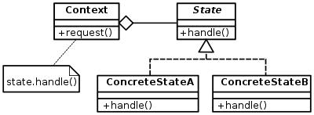

# The State Pattern

## Intent

Allow an object to alter its behaviour when its internal state changes. The
object will appear to change its class.

## Structure

## Terminology

| Term                      | Meaning                                                                                 |
| ------------------------- | --------------------------------------------------------------------------------------- |
| Context                   | Defines the interfface that is of interest to the clients                               |
| State                     | Defines the interface for encapsulating the state and behaviour that those states incur |
| Concrete State Subclasses | Subclass of state that implements the behaviour associated with a state                 |

## Explanation

When encountering problems that can be represented as a state diagram, and
having transitions between those states, there must be a extensible way to
write the code so that functionality can be changed easily without increasing
the costs of validating each change upon transition.

Instead of writing one class that checks for each state and gives the response
of the method on the state of the class, we write subclasses that implement the
behaviour we want, then have the superclass do all the work of validating the
request and encapsulating the state checks.

## Applicability

The State pattern can be used as:
 * An object's behaviour depends on its state, and it must change its behaviour
   at run-time depending on that state.
 * Operations that have large, multipart conditional statements that depend on
   the object's state. State can be represented as enumerated constants.
