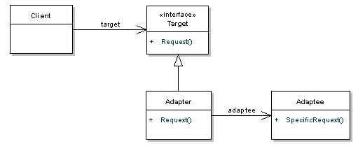

# The Adapter Pattern

## Intent

Convert the interface of a class into another interface clients expect. Adapter
lets classes work together that couldn't otherwise because of incompatible
interfaces.

## Structure

## Terminology

| Term    | Meaning                                                  |
| ------- | -------------------------------------------------------- |
| Target  | Defines the new interface that the client uses           |
| Adapter | Works with objects that implement the existing interface |
| Adaptee | The existing interface that needs to be adapted          |

## Explanation

When creating re-usable classes, there may be times where the interface of the
re-usable class does not match what is needed by some new functionality. The
adapter pattern lets us call the reusable class with an interface that matches
what is needed in the new functionality.

## Applicability

The adapter pattern can be used in multiple situations:
 * You want to use a class that already exists, and its interface does not
   match one that you need.
 * You want to create a reusable class that cooperates with unrelated classes
   that might not have compatible interfaces.
